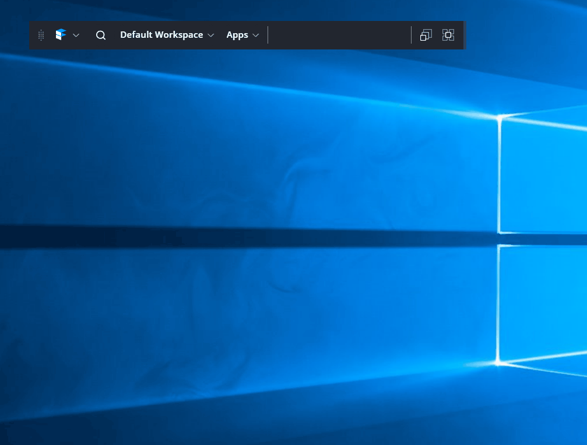

# Programmatically Tabbing Windows Together

You may wish to spawn windows and tab them together. This recipe demonstrates how to to achieve that with the Finsemble 
StackedWindow.



## Programmatic Tabbing

[_tabbingWindows.js_](./tabbingWindows.js) contains the example code for spawning child windows and tabbing them together. The first window is launched and grouped with the parent window. When the second window is launched, a `StackedWindow` is created, and the first and second window spawned are added to it.

**NOTE:** A `StackedWindow` is a container window for holding windows that are tabbed together. 

After the stacked window is created, subsequent tabs are added to the stacked window.

## Installation

To install and run the programmatic tabbing example, please follow the instructions below:

1. Add the `tabbingWindows` component folder to your _src/components_ directory.
1. Either add the configuration in [_config.json_](./config.json) to your _ configs/application/components.json_ OR import it in your _configs/application/config.json_ file:
    ```JSON
        "importConfig": [
            ...,
            "$applicationRoot/components/tabbingWindows/config.json"
        ]
    ```
1. Build and run Finsemble
1. Launch the **Tabbing Windows Example** component
1. Click the **Add Child Window** button to spawn child windows